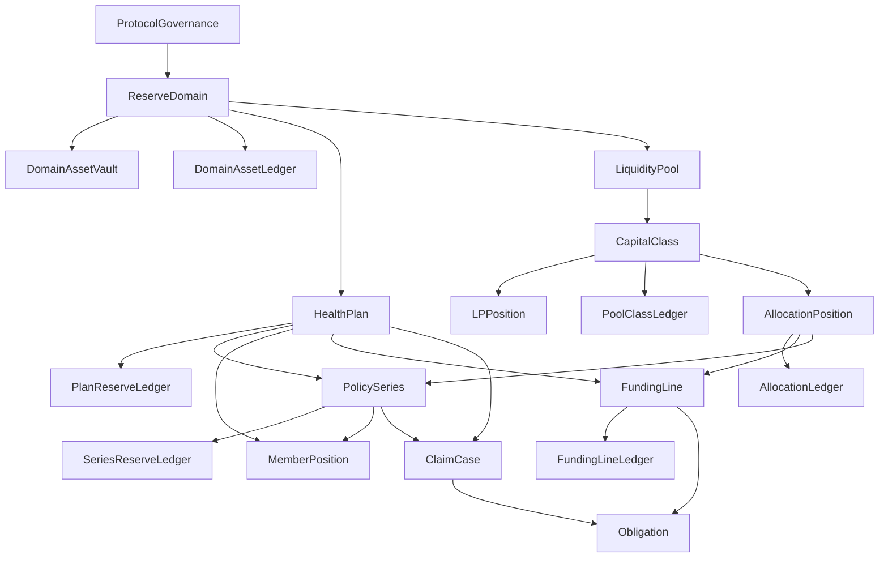

# ADR 0001: Health Capital Markets Rearchitecture

## Status

Accepted on April 3, 2026.

## Context

The pre-rearchitecture OmegaX protocol surface used `Pool` as the root noun for too many economic meanings at once:

- sponsor-funded reward programs
- member-facing plan rights
- treasury custody
- LP-facing liquidity intake
- capital class semantics
- claims reserve bookkeeping

That shape created three long-term failures:

1. sponsor budget and LP capital were too easy to conflate
2. reserve truth existed, but only as partial treasury bookkeeping instead of a canonical accounting kernel
3. product/UI language could not stay economically honest because "pool" meant different things to sponsors, members, and capital providers

OmegaX is still on devnet. This redesign therefore chooses long-term correctness, auditability, and market legibility over backward compatibility.

## Decision

OmegaX Protocol now uses one canonical health capital markets model:

- `ReserveDomain`: the hard legal, custody, and settlement segregation boundary
- `DomainAssetVault`: asset custody per `[reserve_domain, asset_mint]`
- `HealthPlan`: sponsor/member/oracle/compliance/liability root
- `PolicySeries`: immutable economic product lane under one health plan
- `MemberPosition`: member rights and eligibility view for a plan and optional series
- `ClaimCase`: explicit lifecycle for materially reviewed claims
- `Obligation`: canonical owed liability unit
- `FundingLine`: plan-side funding source
- `LiquidityPool`: LP-facing capital sleeve
- `CapitalClass`: investor instrument inside a liquidity pool
- `LPPosition`: capital-provider position inside one capital class
- `AllocationPosition`: explicit bridge from capital class exposure into plan or series funding
- scoped reserve ledgers that together form the reserve kernel

`pool_type` is removed. Sponsor programs and LP capital are not represented by the same primitive.

## Why

### Sponsor budgets are not LP positions

Sponsor budgets are expense-style funding committed to a plan through `FundingLine` accounts. They never mint LP shares and they do not carry redemption rights.

### Policy rights are not capital rights

Members hold `MemberPosition` rights and may be tied to `PolicySeries` terms. Capital providers hold `LPPosition` exposure in a `CapitalClass`. Those positions can interact economically through `AllocationPosition`, but they are never the same object.

### Shared reserve requires explicit attribution

Tokens may sit in shared custody inside one `ReserveDomain`, but attribution must remain explicit by:

- reserve domain
- asset mint
- health plan
- policy series
- funding line
- liquidity pool
- capital class
- allocation position

### Reward and protection must reconcile through one accounting kernel

Fast reward programs and reviewed protection claims differ operationally, but both create `Obligation` state and reconcile through the same reserve ledgers.

## Canonical Object Model

## Accounting Model

The reserve kernel is implemented as multiple scoped ledgers rather than one monolithic global account.

Every scoped ledger exposes the same reserve-truth vocabulary:

- `funded`
- `allocated`
- `reserved`
- `owed`
- `claimable`
- `payable`
- `settled`
- `impaired`
- `pending_redemption`
- `restricted`
- `free`

`free` is always derived from attributable balance, not gross cash:

`free = funded - reserved - claimable - payable - impaired - pending_redemption - restricted`

Additional scopes add their own operational counters:

- `FundingLine`: `committed`, `released`, `returned`
- `CapitalClass`: `nav`, `shares`, `realized_yield`, `realized_losses`
- `AllocationPosition`: `cap`, `utilized`, `reserved_capacity`

Every economically material instruction must update all affected ledgers atomically.

## Reserve Domain Logic

`ReserveDomain` exists only when custody or legal settlement boundaries are real.

Allowed uses:

- open onchain capital domain
- wrapper-mediated segregated domain
- legally ring-fenced RWA domain
- different settlement rails that truly cannot co-mingle

Forbidden uses:

- product marketing labels
- plan categories
- hiding different economics behind similar custody

## Sponsor Budget vs LP Capital

### Sponsor budget path

1. sponsor creates `HealthPlan`
2. sponsor opens `FundingLine` of type `SponsorBudget`
3. sponsor funds that line through a `DomainAssetVault`
4. reward or protection flows create `Obligation` state against that line
5. settlement releases or spends budget without minting LP shares

### LP capital path

1. curator creates `LiquidityPool`
2. pool defines one or more `CapitalClass` instruments
3. LP deposits into one class and receives an `LPPosition`
4. allocator creates `AllocationPosition` bridges into eligible plan funding lines
5. liabilities and yield are attributed back through the allocation and class ledgers

## Allocation Logic

`AllocationPosition` is mandatory for pool-to-plan capital.

It exists to answer:

- which capital class is exposed
- to which funding line
- under what cap
- with what priority or weight
- how much is utilized
- how much capacity is reserved
- how much P&L or impairment belongs to that path

This prevents hidden cross-subsidy and prevents one liquidity pool from impersonating a health plan.

## Compliance, Wrapper, and Open Access Layering

The protocol uses layered tightening rules:

- `ReserveDomain` for hard legal/custody segregation
- `HealthPlan` for sponsor/compliance/oracle baseline
- `PolicySeries` for tighter product semantics
- `CapitalClass` for investor eligibility, transfer, wrapper, and redemption restrictions

Lower layers may tighten upper layers. They may not weaken them.

## Scoped Safety Controls

The redesign uses scoped pause bits and queue-only modes instead of one blunt stop switch:

- protocol emergency pause
- domain rail pause
- plan operations pause
- claim intake pause
- capital subscription pause
- redemption queue-only mode
- allocation freeze or deallocation-only mode
- oracle finality hold

Every control change emits an audit event containing scope, authority, flags, and reason hash.

## Migration Matrix

The detailed matrix lives in [`../MIGRATION_MATRIX.md`](../MIGRATION_MATRIX.md).

High-level replacements:

- `Pool` -> `HealthPlan` or `LiquidityPool`, depending on meaning
- `PoolTerms` -> `HealthPlan` metadata plus `PolicySeries` economics
- `PoolTreasuryReserve` -> scoped reserve ledgers
- `PoolLiquidityConfig` -> `LiquidityPool`
- `PoolCapitalClass` -> `CapitalClass`
- `MembershipRecord` -> `MemberPosition`
- `CoverageClaimRecord` / reward claim state -> `ClaimCase` + `Obligation`

## Rejected Alternatives

### Keep `pool` and clarify it in docs

Rejected. The ambiguity is structural, not editorial.

### Create separate reward and coverage accounting systems

Rejected. Workflow can differ, but economic truth must reconcile through one reserve model.

### Ring-fence every plan by default

Rejected. Shared reserve is useful and desirable, but only with explicit attribution.

### Preserve `pool_type` as dead metadata

Rejected. Dead compatibility nouns keep conceptual debt alive in builders, UI, and audits.

### Treat wrapper classes as separate protocols

Rejected. Capital access restrictions belong in `CapitalClass` unless legal segregation forces a different `ReserveDomain`.

## Consequences

Positive outcomes:

- sponsors can see budgets, obligations, claims, and outcomes cleanly
- capital providers can see exposures, liabilities ahead of them, and redeemable free capital
- members can see rights, claim state, and payouts without mixing themselves into LP mechanics
- docs, SDK, and fixtures can describe one coherent system

Costs accepted:

- hard-break migration on devnet
- larger immediate rename surface across program, docs, scripts, tests, and frontend
- retirement of a broad pool-centric reader surface

## Open Questions

Only two deliberately deferred items remain from this ADR:

1. which external yield adapters will become first-class after public adapter review
2. whether secondary distribution of capital-class interests should ship through direct transfer, wrapper, or auction pathways first

Neither question changes the canonical nouns or reserve kernel adopted here.

The yield-adapter question is resolved at the protocol-surface level by
[`ADR 0002: Reserve Productivity and Strategy Adapter Surface`](./0002-reserve-productivity-and-strategy-adapters.md).
Specific adapters still require their own public review before production use.
